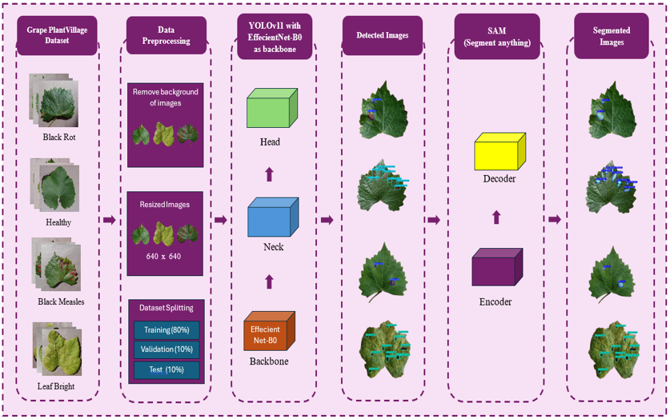
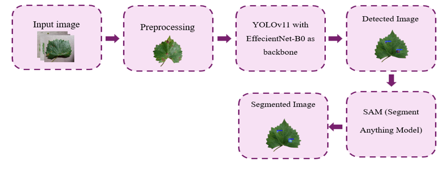

# Precise segmentation and classification of Grape leaf disease using YOLOv11

  

This repository contains the implementation of a hybrid deep learning framework for multi-class grape leaf disease detection and segmentation. The proposed framework integrates YOLOv11 with an EfficientNet-B0 backbone for object detection and Segment Anything Model (SAM) for precise pixel-level segmentation.

## Dataset
The model was evaluated on a Grape Leaf Disease datasets containing 4,639 images across four categories:
<ul>
  <li>Leaf Blight</li>
  <li>Black Rot</li>
  <li>Healthy</li>
  <li>Black Measles (Esca)</li>
</ul>

## Framework
Input Image
     ↓
EfficientNet-B0 Backbone
     ↓
YOLOv11 Detection
     ↓
Disease Bounding Boxes
     ↓
SAM Segmentation
     ↓
Disease Segmentation Masks

  

## Main Objectives
<ul>
  <li>Multi-class grape leaf disease detection</li>
  <li>Accurate localization of diseased regions</li>
  <li>Pixel-level segmentation of disease areas</li>
  <li>Evaluation of a hybrid YOLOv11–EfficientNet-B0–SAM framework</li>
</ul>

