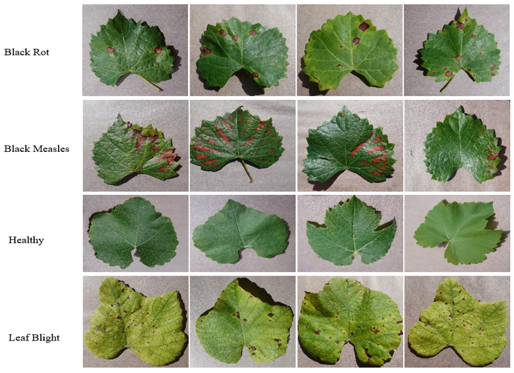

# Dataset
The Grape PlantVillage dataset has four classes: Black rot, Black Measles (Esca), healthy, and Leaf blight. 

  

# Dataset Source
The complete dataset can be accessed from the original source:
A. Ali, PlantVillage dataset [Online]. Available: https://www.kaggle.com/datasets/abdallahalidev/plantvillage-dataset, 2019.

# Dataset Organization

The dataset was organized into training, validation, and testing subsets according to the experimental setup described in the research paper.
For reproduction, download the dataset from the original source and update the dataset path in the corresponding configuration file.
